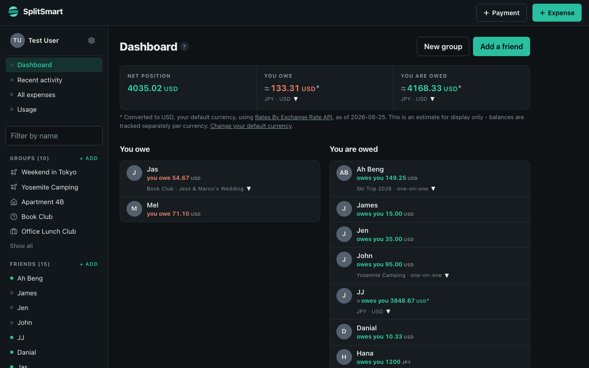
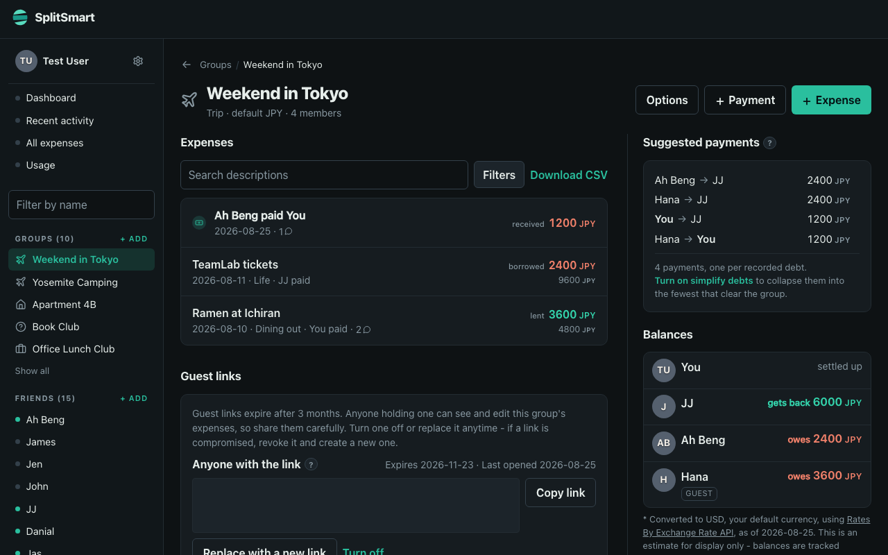
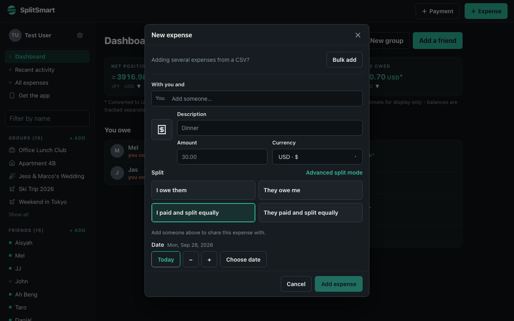

# SplitSmart

A self-hosted Splitwise replacement. One Node process, one SQLite file, a JSON
API at `/api/v1`.

A public instance is at **[splitsmart.cjx3711.com](https://splitsmart.cjx3711.com)**
if you want to try it without running anything. Treat it as a convenient copy
of a spreadsheet, not a bank.

<p align="center">
  <a href="SCREENSHOTS.md"></a>
</p>
<p align="center">
  <a href="SCREENSHOTS.md"></a>
  <a href="SCREENSHOTS.md"></a>
</p>

<p align="center"><a href="SCREENSHOTS.md">More screenshots</a> — groups, friends, a guest link, desktop and phone.</p>

## Why

Splitwise is moving API access behind a paywall. This keeps the data, the
splitting, and the API surface under your own control. The longer write-up is
[I built a Splitwise clone out of spite](https://chaijiaxun.com/blog/i-built-a-splitwise-clone-out-of-spite/).

Two differences from Splitwise, both deliberate:

- **Guest links.** Share a group, or one person's view of it, as a URL. Whoever
  opens it uses the app with no email and no password, and you can switch the
  link off whenever you like. One real account is enough for a whole group.
  See [docs/GUEST.md](docs/GUEST.md).
- **Self-hosted.** Single Node process, single SQLite file, one container.

## Quick start

```bash
yarn install
cp .env.example .env
```

Generate a session secret and put it in `.env`:

```bash
node -e "console.log(require('crypto').randomBytes(32).toString('base64url'))"
```

Then:

```bash
yarn db:migrate && yarn db:seed
yarn dev
```

API on `http://localhost:5545`, frontend on `http://localhost:5173`.

## Demo data

To explore the UI with sample friends, groups, and expenses instead of an empty
account:

1. Register an account at `/app/login?register` (or use any email you prefer).
2. Seed demo data for that account:

```bash
yarn seed:demo                  # defaults to test@example.com
yarn seed:demo -- you@example.com
```

This creates 15 friends (a mix of real accounts and guest placeholders), ten
groups, eight expenses, one settlement payment, two recurring series with the
bills they have generated so far, a handful of comments (including one generated
automatically by an edit), and two guest links it prints once. The sidebar shows the five newest groups and ten newest friends; anything
beyond that links to the full list pages. It is idempotent: if the account
already has expenses, the script skips.

After `yarn db:reset`, register again and re-run `yarn seed:demo`.

## Bulk add expenses from CSV

Choose **Bulk add** on the dashboard, All expenses, or a friend/group page.
It is also available at the top of the **Expense** dialog and carries the
selected group or friend into the import.
Upload a CSV (up to 500 expenses / 2 MB), or copy the included LLM prompt to
turn receipt or statement text into the expected format. Choose the group,
payer, and people to split between first: the prompt includes only those people
and you, the selected group and currency, and the available categories. Switching
groups selects that group's members and default currency. IDs in the prompt use
their last eight characters, extended when needed to avoid ambiguity. You can
also paste CSV directly.

```csv
date,description,amount,currency,paid_by,split_with,group,category,notes
2026-09-24,Dinner,42,USD,me,me;Alex,,,
```

`date`, `description`, and `amount` are required columns. Optional fields use
the defaults shown before upload. People and groups accept full IDs, unique ID
suffixes of at least eight characters, or unique names;
categories accept IDs or unique names/paths. Separate people in `split_with`
with semicolons. These are the people who owe equal shares; include the payer
only when they share the cost. For an expense Alex paid entirely for you, use
`paid_by=Alex` and `split_with=me`.

Review and edit every row before adding. Unrecognized people, invalid dates,
unsupported currencies, and excess decimal precision must be corrected or
removed. The reviewed batch is saved atomically to the device and queued for
normal offline sync. Connection retries reuse expense IDs; uploading the same
file again intentionally creates new expenses. Unequal splits and multiple
payers use the regular expense form.

The browser regression covers upload, corrections, offline sync, and batch
rollback. With the seeded smoke server running, use
`node scripts/smoke-bulk-add.mjs` (optional arguments: base URL and screenshot
directory). It creates test expenses in that server's database.
`node scripts/smoke-sync-recovery.mjs` checks loading failures, retrying sync,
and entering bulk add from the expense dialog without creating ledger entries.

After updating an existing installation, run `yarn db:migrate` before starting
the server. Migration 003 adds the group totals setting without resetting data;
it also handles development databases that already contain the column.

## Export your Splitwise data first

This is the one step with a deadline. It writes raw, untransformed JSON to
`splitwise-export/<timestamp>/` and does not touch the database, so re-importing
after a schema change never needs another API call.

```bash
SPLITWISE_API_KEY=... yarn export:splitwise
```

Get a key from [secure.splitwise.com/apps](https://secure.splitwise.com/apps).
The output is gitignored; back it up somewhere private.

## Commands

```bash
yarn dev             # API + frontend with reload
yarn test            # split engine, money, auth, native API
yarn typecheck       # server + web
yarn db:check        # audit data integrity
yarn db:reset        # wipe and rebuild locally
yarn seed:demo       # sample friends, groups, and expenses (see above)
yarn build           # production build
```

## Documentation

- **[SCREENSHOTS.md](SCREENSHOTS.md)**: what the app looks like
- **[I built a Splitwise clone out of spite](https://chaijiaxun.com/blog/i-built-a-splitwise-clone-out-of-spite/)**: why this exists
- **[CLAUDE.md](CLAUDE.md)**: how the repo works, and the four rules that keep
  financial data correct. Read this before changing anything.
- [docs/DATA_MODEL.md](docs/DATA_MODEL.md): schema reasoning
- [docs/GUEST.md](docs/GUEST.md): guest links, the two shells, and claiming
- [docs/OFFLINE.md](docs/OFFLINE.md): the Dexie mirror, outbox, and what stays online-only
- The HTTP API is documented in the app at `/docs`

## Status

Working: accounts, groups, friends, all six split types with an editor, one-on-one
expenses, per-currency balances, settle-up suggestions, comments (including the
automatic ones written when a bill is edited), recurring expenses, expense search
and filters, CSV export, undo for a deleted expense, guest links and claiming,
the Splitwise importer, email verification, password reset, API tokens, and
offline reads and writes for `/app` (see [docs/OFFLINE.md](docs/OFFLINE.md)).

Not yet: changing the account email, group invites by email. Adding a friend,
creating a group, and guest-link visitors stay online-only on purpose.

## License

[GNU Affero General Public License v3.0](LICENSE) (`AGPL-3.0-only`).

Running SplitSmart for yourself or your household carries no obligations. The
licence matters if you **distribute** a modified version, or **offer one to
other people over a network**: then those users are entitled to its source. That
is the whole reason for AGPL rather than MIT here - this is a self-hosted
replacement for a paid service, and the one thing worth ruling out is somebody
re-selling it as a closed hosted product.

`fixtures/splitwise/` is not covered by that licence. Those files are verbatim
captures of Splitwise's own API responses (their category tree and currency
list), kept as read-only ground truth so imported ids resolve to the same
categories; see [CLAUDE.md](CLAUDE.md). They belong to Splitwise.

Not affiliated with, endorsed by, or connected to Splitwise.
